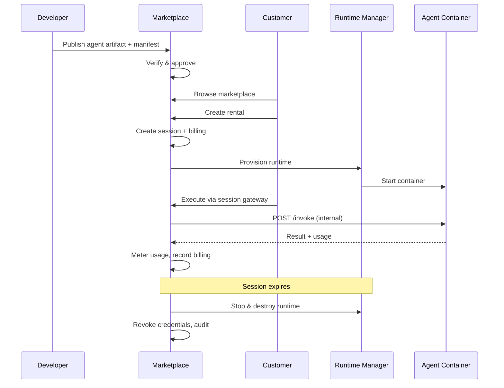
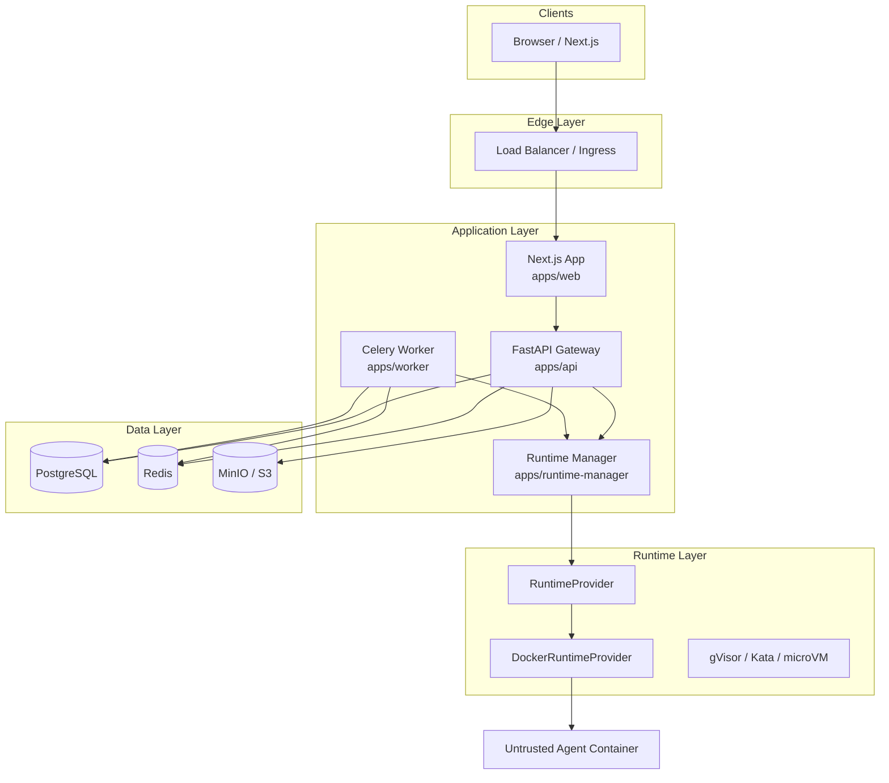
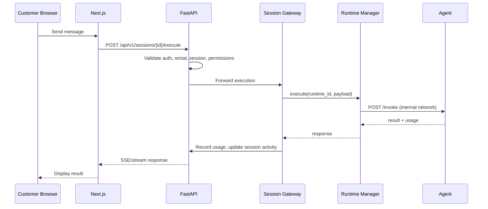
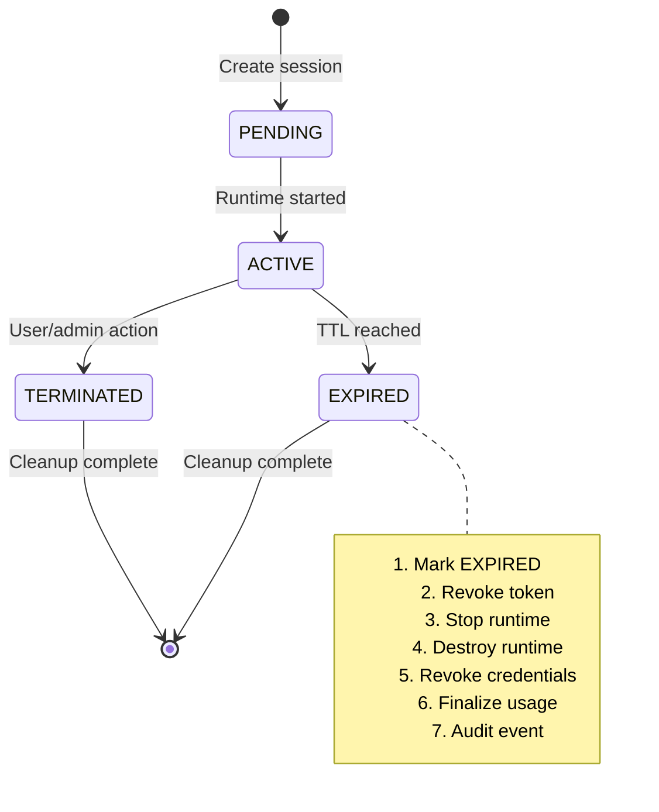

# AgentHub — Architecture

> Secure AI Agent Marketplace & Rental Platform

## Overview

AgentHub is an **App Store + SaaS marketplace + cloud runtime + AI workforce marketplace** where developers publish executable AI agents and customers discover, rent, execute, monitor, and pay for them.

### Core Business Flow



### Critical Entity Separation

These concepts are **never conflated**:

| Entity | Purpose |
|--------|---------|
| **Agent** | Marketplace listing identity |
| **AgentVersion** | Immutable published version |
| **AgentArtifact** | Docker image digest + manifest |
| **RuntimeInstance** | Ephemeral execution environment |
| **Rental** | Customer's paid access period |
| **RentalSession** | Active interaction window |
| **AgentExecution** | Single invoke/request |
| **UsageRecord** | Authoritative metering data |

```
Agent
 ├── Version 1.0 ── Artifact (digest + manifest)
 ├── Version 1.1 ── Artifact
 └── Version 2.0 ── Artifact

Customer Rental A
 ├── Session 1 ── RuntimeInstance ── Executions[]
 └── Session 2 ── RuntimeInstance ── Executions[]
```

---

## System Architecture



---

## Monorepo Structure

```
agent-marketplace/
├── apps/
│   ├── web/                  # Next.js 15, App Router, shadcn/ui
│   ├── api/                  # FastAPI, SQLAlchemy 2, Alembic
│   ├── runtime-manager/      # Runtime orchestration service
│   └── worker/               # Celery background jobs
├── packages/
│   ├── agent-sdk/            # Python SDK for agent developers
│   ├── shared-types/         # Shared TypeScript types + OpenAPI client
│   └── ui/                   # Shared UI components (optional)
├── agents/
│   ├── research-agent/
│   ├── resume-agent/
│   ├── invoice-agent/
│   ├── support-agent/
│   └── asset-agent/
├── infra/
│   ├── docker/
│   ├── kubernetes/
│   └── terraform/
├── docs/
├── tests/
├── docker-compose.yml
└── .env.example
```

---

## Service Responsibilities

### apps/web (Next.js)

- SSR for marketplace, agent detail, dashboards
- Client components for workspace, chat, timers
- Server-side route protection
- TanStack Query for API state
- Generated TypeScript client from OpenAPI

### apps/api (FastAPI)

- Authentication & authorization (JWT + refresh rotation)
- Marketplace CRUD, search, reviews
- Rental/session lifecycle
- Billing abstraction (MockBillingProvider)
- Session gateway (never exposes runtime directly)
- Permission enforcement & human approval
- Audit & security events
- Rate limiting via Redis

### apps/runtime-manager

- **RuntimeProvider** abstraction
- **DockerRuntimeProvider** (MVP)
- Container lifecycle: create → start → stop → destroy
- Resource limits, seccomp, non-root, network policies
- Internal `/invoke` proxy to agent containers
- Usage collection from runtime metrics

### apps/worker (Celery)

- `expire_sessions` — periodic session cleanup
- `cleanup_runtimes` — orphaned runtime termination
- `revoke_credentials` — post-session credential revocation
- `process_usage` — aggregate usage records
- `send_notifications`
- `process_verification` — agent verification pipeline
- `calculate_revenue`

---

## Key Abstractions

### RuntimeProvider

```python
class RuntimeProvider(Protocol):
    async def create(self, spec: RuntimeSpec) -> RuntimeInstance
    async def start(self, instance_id: str) -> None
    async def stop(self, instance_id: str) -> None
    async def destroy(self, instance_id: str) -> None
    async def status(self, instance_id: str) -> RuntimeStatus
    async def logs(self, instance_id: str) -> AsyncIterator[str]
    async def execute(self, instance_id: str, payload: dict) -> dict
```

Future providers: gVisor, Kata, Firecracker, Kubernetes, managed sandbox.

### BillingProvider

```python
class BillingProvider(Protocol):
    async def charge(self, request: ChargeRequest) -> Transaction
    async def refund(self, request: RefundRequest) -> Transaction
    async def get_balance(self, customer_id: UUID) -> Balance
```

MVP: `MockBillingProvider`. Future: Stripe, M-Pesa, Flutterwave.

### SecretProvider

Session-scoped, short-lived credentials. Revoked on session end.

### ModelProvider

Platform-mediated model access. Keys never exposed to customers or agents directly.

### StorageProvider

S3-compatible abstraction. MinIO in dev, AWS S3 / R2 / Azure in production.

### VectorSearchProvider (future)

Abstraction over pgvector for semantic agent search. Schema prepared, not enabled in MVP.

---

## Request Flow — Agent Execution



**Customer NEVER receives:**
- Docker credentials
- Source code / private prompts
- Container filesystem access
- Runtime API endpoints
- Internal environment variables

---

## Multi-Tenancy

Every query scoped by ownership:

```python
# Always filter by authenticated user's tenant boundary
select(Rental).where(
    Rental.customer_id == current_user.customer_profile.id,
    Rental.id == rental_id,
)
```

Cross-tenant access attempts → `403 FORBIDDEN` + security event.

---

## Session Lifecycle



Background worker runs `expire_sessions` every 60s — **not reliant on client requests**.

---

## Network Isolation (Agent Containers)

| Policy | Description |
|--------|-------------|
| `NONE` | No network access |
| `INTERNET_READ` | Outbound HTTP/HTTPS only |
| `INTERNET_FULL` | Full outbound (restricted in MVP) |
| `ALLOWLIST` | Specific domains only |

Agents **cannot** access: PostgreSQL, Redis, Docker daemon, K8s API, internal admin APIs, secret store.

---

## Container Security Checklist

- Non-root execution
- Read-only root filesystem where possible
- CPU / memory / PID limits
- Execution timeout
- Ephemeral filesystem
- Dropped Linux capabilities
- seccomp profile
- No `--privileged`
- No `/var/run/docker.sock` mount
- Immutable image digests (never `latest`)

---

## Observability

OpenTelemetry instrumentation across:

- FastAPI (HTTP spans)
- SQLAlchemy (DB spans)
- Redis operations
- Runtime manager operations
- Agent executions
- Background jobs

Export to OTLP → Prometheus / Grafana (production).

Every request carries a **correlation ID** propagated through all services.

---

## Technology Stack

| Layer | Technology |
|-------|------------|
| Frontend | Next.js 15, React, TypeScript, Tailwind, shadcn/ui, TanStack Query, RHF, Zod |
| Backend | Python 3.13+, FastAPI, Pydantic v2, SQLAlchemy 2.x, Alembic, asyncpg |
| Database | PostgreSQL 16 (+ pgvector extension ready) |
| Cache/Jobs | Redis, Celery |
| Storage | MinIO (dev), S3-compatible (prod) |
| Runtime | Docker (MVP), gVisor/Kata (future) |
| Auth | JWT + refresh rotation, Argon2, HTTP-only cookies |
| Observability | OpenTelemetry |
| CI | GitHub Actions |

---

## API Surface

```
/api/v1/auth          — register, login, logout, refresh
/api/v1/marketplace   — search, featured, categories
/api/v1/agents        — CRUD, versions, publish
/api/v1/rentals       — create, list, cancel
/api/v1/sessions      — create, extend, execute, status
/api/v1/executions    — history, detail
/api/v1/runtime       — admin runtime management
/api/v1/billing       — transactions, balance
/api/v1/developer     — developer dashboard data
/api/v1/admin         — moderation, audit, security
/health               — liveness
/ready                — readiness (DB + Redis)
```

---

## Threat Model Summary

See [THREAT_MODEL.md](./THREAT_MODEL.md) for full analysis.

Defense in depth via: least privilege, container isolation, permission model, human approval for high-risk actions, audit logging, rate limiting, cross-tenant query enforcement, session-scoped credentials, immutable artifacts.
