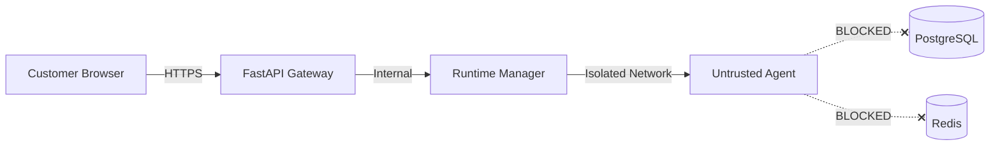

# AgentHub Threat Model

## Assets

- Customer data (uploads, conversations, billing)
- Developer IP (agent artifacts, manifests — not source code)
- Platform credentials (DB, Redis, model API keys)
- Session tokens and runtime access
- Financial transaction records

## Threat Actors

| Actor | Goal |
|-------|------|
| Malicious developer | Escape container, steal customer data, cryptomine |
| Malicious customer | Steal agent IP, access other tenants' data |
| External attacker | Credential theft, session hijacking, DoS |
| Compromised agent | Tool abuse, data exfiltration, prompt injection |

## Attack Vectors & Mitigations

### Container Escape
- **Mitigation:** Non-root, dropped capabilities, seccomp, read-only rootfs, no privileged mode, no docker.sock mount

### Cross-Tenant Access
- **Mitigation:** Server-side ownership checks on every query, never trust client-supplied IDs

### Agent Theft
- **Mitigation:** Session gateway, no direct runtime access, immutable digests, network isolation

### Credential Theft
- **Mitigation:** Session-scoped credentials, hashed token storage, refresh rotation, revocation on logout/expiry

### Supply-Chain Attack
- **Mitigation:** Image verification pipeline, digest pinning, scanning abstraction, admin review

### Resource Exhaustion
- **Mitigation:** CPU/memory/PID limits, rate limiting, execution timeouts, rental billing caps

### Prompt Injection / Tool Abuse
- **Mitigation:** Permission model, human approval for high-risk actions, audit logging

## Trust Boundaries

Security must not depend on the AI model behaving correctly.
